# TRENLINE (E-Commerce) Sales Data Analysis  

Bookmarks:  
- [Executive Summary](#Executive-Summary)
- [Recommendations](#Recommendations)
- [Analysis Deep Dive](#Analysis-Deep-Dive)  
- [Conclusion](#Conclusion)

## Defined Terms  

- **YOY (Year-Over-Year):** The percentage or absolute change in a metric compared to the same period in the previous year.  
- **CLV (Customer Lifetime Value):** The estimated total revenue a customer will generate throughout their relationship with a business.  
- **ROAS (Return on Advertising Spend):** A ratio measuring revenue earned for every dollar spent on advertising.
- **Direct Marketing:** Promotional efforts targeting consumers through direct digital ads, bypassing intermediaries.  
- **Email Marketing:** Promotional messages sent via email to past customers or loyalty members.  
- **Affiliate Marketing:** A performance-based marketing model where third parties earn commissions for driving sales.  
- **Social Media Marketing:** Using organic content to promote products on social platforms without paid advertising.  

## Background and Overview  
Trenline is a global online retailer specializing in consumer electronics. Since commencing operations in 2019, the company has averaged over $5 million in annual net sales, representing a share of the $650 billion E-commerce market.  

Trenline’s primary marketing strategy involves direct online advertisements promoting one of eight consumer electronics products. Additionally, the company offers a loyalty program aimed at fostering customer retention.  

This report aims to:  
- Identify emerging sales trends from 2019 to 2022 
- Analyze key performance drivers  
- Provide data-driven recomendations to impove future sales performance  

## Data Structure Summary  

  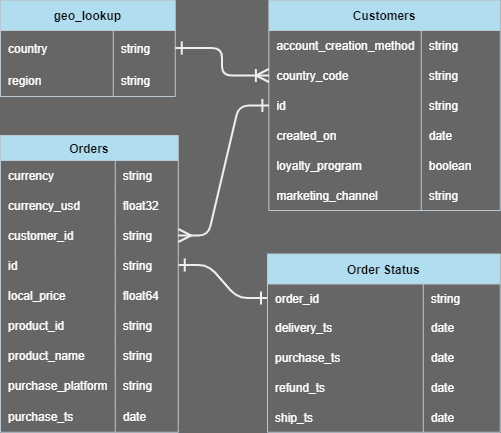

Four tables were provided for this anlaysis, with relations shown above.

The Orders and Customers table provide the bulk of the sales data, with geo_lookup provding region grouping and order_status tracking order returns.

## Executive Summary  

### Annual Revenue Trends  
- Revenue peaked in 2020 at $7.2M, a YOY increase of 167% after the first year of operations in 2019
- The following years expierienced YOY decreases of 9% in 2021 ($6.5M) and 42% in 2022 ($3.8M)

  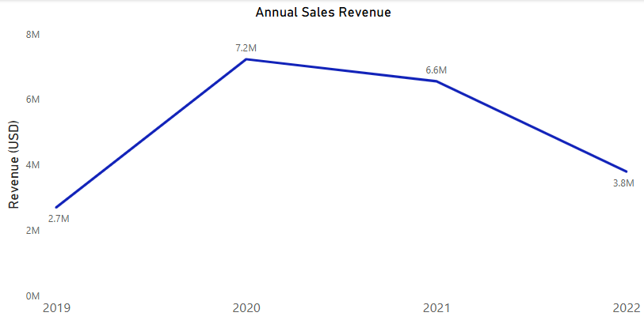

### Sales Channels  
- The Direct Marketing Channel accounts for 83% of revenue
- Revenue from Direct Marketing dropped 11.5% YoY in 2021 ($6.1M to $5.4M) and declined further by 46.3% YoY in 2022 ($5.4M to $2.9M)
- These trends suggest a significant reduction in ROAS, driven by increasing competition in online advertising and diminishing cost-effectiveness of ads  (further details)

  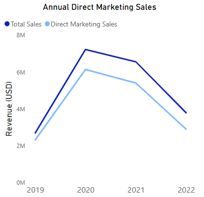  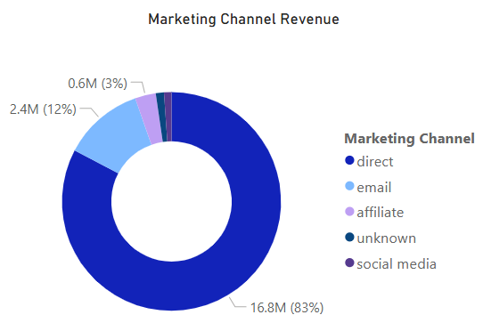  

### Customer Memberships  
- The loyalty program has not demonstrated a significant impact on Customer Lifetime Value (CLV):  
  - Loyalty member CLV is 24% lower than non-members
  - Less than 1% of loyalty members make repeat purchases, compared to 9% of non-members

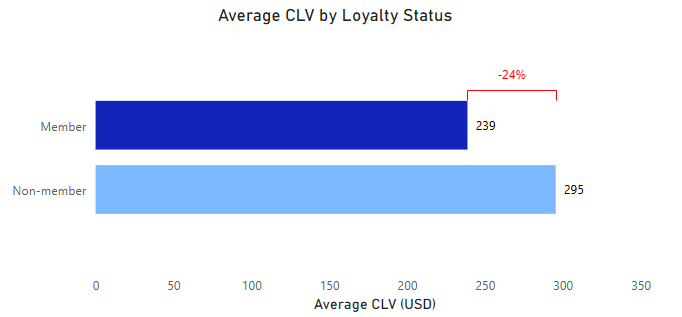  

   

### Product Offerings  
- Four products account for over 96% of total revenue:  
  - 63% of revenue and 66% of total order volume is driven by two mid-priced products: a gaming monitor and Apple headphones (priced $100–$1,000)  
  - High-priced items, including MacBook and ThinkPad laptops (priced >$1,000), contribute 33% of revenue and 6% of total order volume 

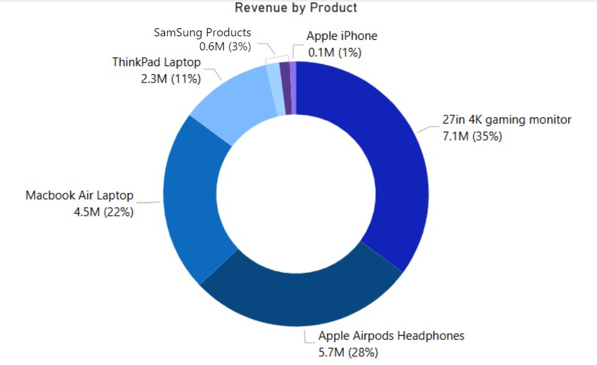  

---  

## Recommendations  

1. **Focus Direct Marketing on Top Performers**  
   - Limit direct marketing efforts on the top four performing products (gaming monitor, Apple headphones, MacBook, and ThinkPad laptops)

2. **Leverage Membership for E-Mail Marketing**  
   - Use the loyalty program to target members with personalized email campaigns focusing on:  
     - Similar products to previous purchases
     - Complementary products(ie Apple headphones for previous iPhone customers)
     - Exclusive discounts or product bundles to drive additional purchases and increase retention

3. **Expand Product Offerings**  
   - Introduce mid-to-high priced, high-demand products such as TVs, Android smartphones, and Apple Watches 
   - Provide loyalty members with exclusive deals on these new offerings

4. **Enhance the Loyalty Program**  
   - Redesign the program to improve its perceived value and increase CLV:  
     - Introduce tiered rewards to incentivize repeat purchases  
     - Offer targeted promotions
     - Create tailored offers based on purchase history to increase engagement

---  

# Analysis Deep Dive  

### Sales Revenue Analysis  
- **2020 Surge:** Sales revenue YoY increased by 168% 
  - January 2020 revenue exceeded previous monthly averages by 63%  
  - February 2020 achieved a 145% increase over monthly averages

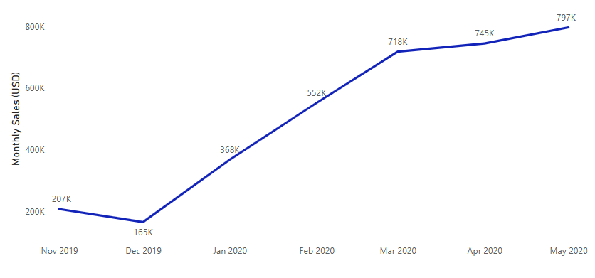 

- **2021 Plateau:** Sales revenue YoY decreased 9%, with the number of sales increasing 6% 
  - MacBook and ThinkPad laptops performed 30% worse than 2020 
  - Gaming monitor sales improved by 8%
  - Samsung webcams saw a 165% revenue increase (an additional $80K)  

- **2022 Recession:** Sales revenue YoY decreased 42% 
  - Sales of the top four dominant products declined by 40%-50% 
  - Accessories and peripherals dropped by 35%  
  - Budget laptop sales saw a slight improvement of 5%

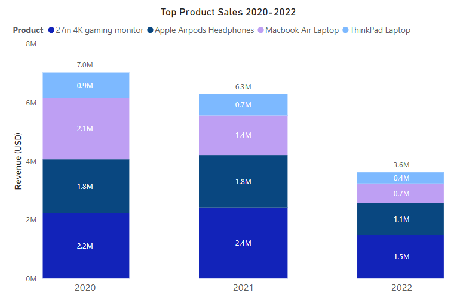 

### Marketing Channel Analysis  
- **Advertising Channel Performance**  
  - Direct marketing (ads delivered on webpages) acquired 77% of customers and contributed 83% of revenue  
  - E-mail marketing accounted for 17% of orders and 12% of revenue  
  - Affiliate, social media, and others contributed 6% of orders and 5% of revenue 
- **2020 vs. 2022 Performance:**  
  - Sales from all marketing channels dropped 48% in 2022 compared to 2020 
  - Direct marketing experienced a 53% decline, while E-Mail marketing decreased by only 15%

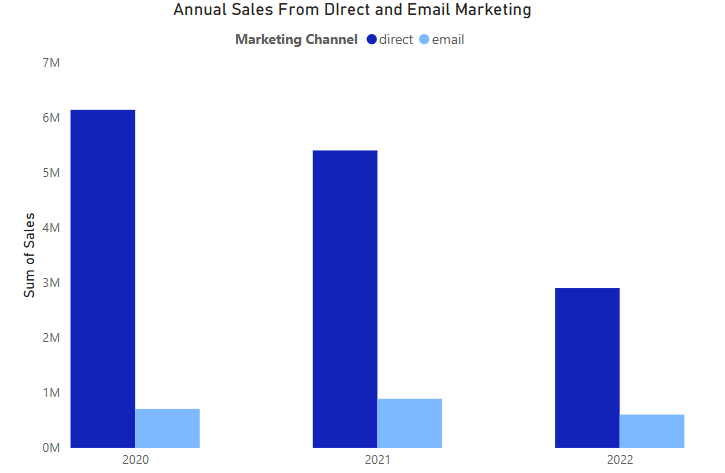 

### Geographic Sales Analysis  
- **Regional Contributions:**  
  - North America accounts for over 50% of total sales
  - Combined, North America and Europe generate 72% of global sales
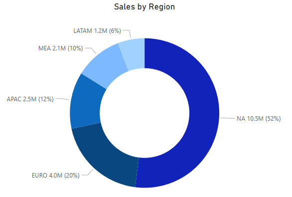

- **Regional Product Preferences:**  
  - Laptop sales are lower in the Middle East and Asia (MEA), representing 28% of sales versus the global average of 36%
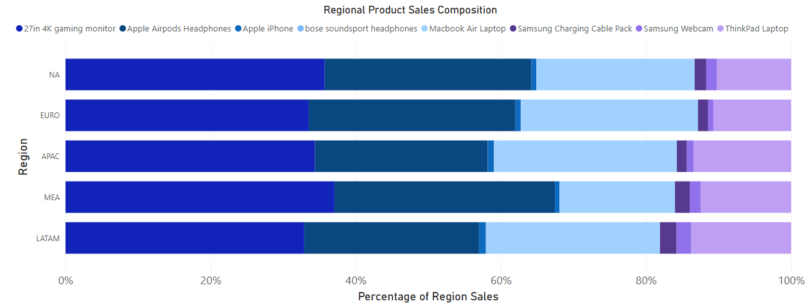

- **Regional Marketing Channels:**  
  - Sales from various channels performed similarly across regions
  - E-mail marketing slightly underperformed in Europe (8% of sales instead of the global average of 12%)
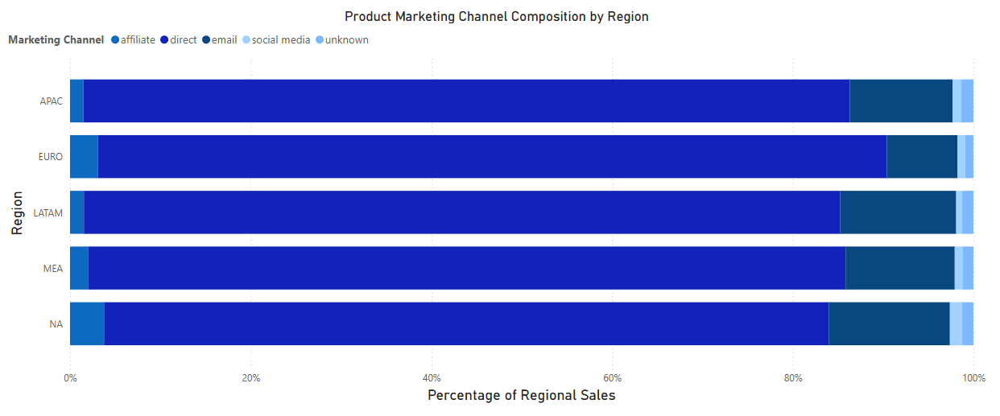

### Product Sales Analysis  
- Since launching six products in 2019, Trenline expanded to eight offerings in 2020
- Four products dominate, contributing 96% of total revenue
  - Two mid-priced products (gaming monitor, Apple headphones) account for 63% 
  - High-end laptops (MacBook, ThinkPad) generate 33%
- Lower-performing or lower-margin products may benefit from being marketed to loyalty members

### Loyalty Membership Analysis  
- Non-members demonstrate higher retention, with 8% making repeat purchases compared to <1% of loyalty members (less than 30 total repeated orders by members)
- Average Order Value (AOV) for loyalty members is 11% lower than for non-members, and CLV is 24% lower
- The loyalty program requires significant updates to better drive engagement and CLV
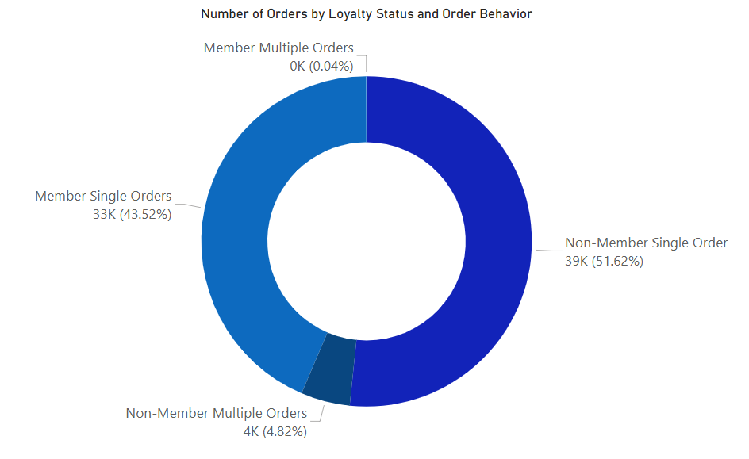

## Conclusion   

Trenline is facing serious challenges which are jeopardizing their business model. With their most lucrative sales channel continuing to become less profitable due to decreasing ROAS, Action must be taken to increase investment into long-term stable advertising channels. Offering more incentives for members can increase the marketing reach and depend less on direct product offers online. Offering a greater, customer-specific selection to Loyalty Members can increase CLV, leading to fewer Customer Acquisition Costs. 

## Data Integrity Notes
Trenline does not keep accurate accounts of advertisement spending throughout the marketing channels. Additional measures are recomended for specific marketing recomendations.

