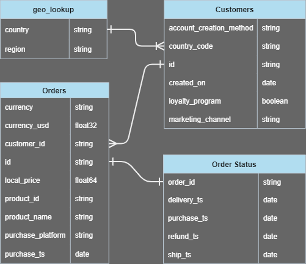
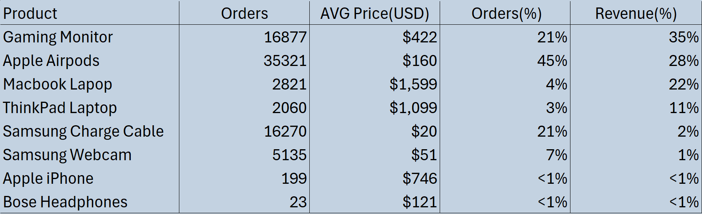

# TRENLINE (E-Commerce) Marketing and Sales Analysis  

Bookmarks:  
- [Background](#background-and-overview)
- [Executive Summary](#Executive-Summary)
- [Recommendations](#Recommendations)
- [Analysis Deep Dive](#Analysis-Deep-Dive)  

## Defined Terms  

- **LMP (Loyalty Member Program):** Trenline's free Membership program, prompting users to create a member account.
- **YOY (Year-Over-Year):** The percentage or absolute change in a metric compared to the same period in the previous year.  
- **CLV (Customer Lifetime Value):** The estimated total revenue a customer will generate throughout their relationship with a business.  
- **ROAS (Return on Advertising Spend):** A ratio measuring revenue earned for every dollar spent on advertising.
- **Direct Marketing:** Promotional efforts targeting consumers through digital advertisemets via internet browsing services 
- **Email Marketing:** Promotional messages sent via email to past customers or loyalty members.  
- **Affiliate Marketing:** A performance-based marketing model where third parties earn commissions for driving sales.  
- **Social Media Marketing:** Using organic content to promote products on social platforms without paid advertising.  

## Background and Overview  

Trenline is a global online retailer specializing in consumer electronics. Since commencing operations in 2019, the company has averaged over $5 million in annual net sales, representing a share of the \$650 billion E-commerce market.  

Trenline’s primary marketing strategy involves direct online advertisements promoting one of eight consumer electronics products. Additionally, the company offers a loyalty program aimed at fostering customer retention.  

This report aims to:  
- Support the Marketing Team with insights and recomendations to increase sales  
- Uncover key drivers in sales channels
- Identify emerging sales trends from 2019 to 2022 
- Provide data-supported changes to the Member Loyalty Program

## Data Structure Summary  

  

Four tables were provided for this anlaysis shown above:

- **orders:** Contians the unique order identifier (id is the primary key) and data about purchase. It includes the customer identifier (customer_id), the product purchased (product_name), purchase date (purchase_ts), and purchase value in USD (currency_usd).

- **customers:** Contains the unique order id (id foreign key for orders) and customer information. It contains the marketing channel that achieved the initial sale (marketing_channel), the customers member status (loyalty_program), and the customer's country (country_code).

- **order_status:** Holds information about order returns (order_id being the foreign key for orders). Important dates are stored here such as the purchase date (purchase_ts), ship date (ship_ts), the delivery date (delivery_ts), and refund date (refund_ts). ***Note**: Only orders that were returned were added to this table*

- **geo_loopup:** A table for catagorizing countries (country as primary key) into regions including Asia and the Pacific (APAC) Europe (EURO), Latin America (LATAM), Middle East and Africa (MEA), and North America (NA).

## Executive Summary  

Sales have been declining since peaking in 2020 with Sales of \$7.2M, with 2021 YOY Sales dropping 9% (\$6.5M) and YOY decreasing a further 42% (\$3.8M) in 2022. The drops in sales are driven mainly by fewer sales through the Direct Marketing Channel, which has accounted for 83% of revenue historically. Seasonal sales trends suggest sales performance decreases during months of high consumer demand. Sales in November and December were 28% lower compared to the rest of the year. Decreasing YOY sales could indicate increased competition in the market, and cause worse Direct Marketing performance. Product offerings have been very static during the 4 years of opperation with 8 product types offered. 96% of sales are generated by 4 of these categories which include Macbooks, ThinkPads, Apple Headphones, and Gaming Monitors. Sales from the Member Loyalty Program are having little impact on CLV, with less than 1% of Loyalty customers making repeted purchases.

## Sales Analysis Deep Dive

### Revenue Trends  
Revenue peaked in 2020 at $7.2M, a YOY increase of 167% after the first year of operations in 2019 The following years expierienced YOY decreases of 9% in 2021 (\$6.5M) and 42% in 2022 (\$3.8M). Electronics sales perfrom best consistantly Febuary through May and including October while underperforming in September, November, and December. The lack of sales at the end of the year is concernign considering the last 2 months of the year being high retail-demand months during Holidays.

  

### Sales Channels

The Direct Marketing channel continues to dominate sales traffic, with it making up 77% of 2022 sales. This is however less in absolute and realative value compared to the rest of the marketing channels. Direct Marketing in 2020 contributed 85% of sales and has been slowly diminishing both in absolute value and comparatively. The cause of the decline is unknown, but seasonal trends suggest worse sales performance in holiday seasons (November-December). Performance in these months are lower than the typical low demand month of January. This could be the leading driver on lowering ROAS, caused by increased advertising competition. 

The next-best perfoming Marketing Channel is E-Mail which has gained realative size of 15% of total sales in 2022 from 10% in 2020. Sales from this channel however are still decreasing in absolute value. While it makes sence that as more customers are added to the E-Mail listing it would be more prelevant, the absolute value of orders through the channel decreasing is still a concern. 

Sales from Affiliates, and Social Media are very neglegable, attributing 5% of sales in 2022. While these channels may not directly lead to many product sales, they provide the oppertunity to showcase offers and gain brand exposure. Social media could be utalized to showcase LMP offers to encourage customers to signup which will allow promotion of E-Mail Marketing offers. Affiliates could be granted direct bonuses for program signups, increasing reach.

### Geography Analysis 

Sales have been distributed very evenly across regions with North America (NA) Being the largest market with over 50% of sales. Followed by Europe (20%), Asia and Pacific (12%), Middle East and Africa (10%), and Latin America (6%). Product sales have also been very consistant across regions with little variation besides ThinkPad and Macbook laptops selling slightly less in MEA compared to other products. Further research is needed to investigate product demand across regions. 

  

Marketing channel performance varies little across regions as well, with the exception beign Europe favoring Direct over E-Mail Channels realative to  other regions.

  

  

### Customer Memberships  
The LMP has not demonstrated a significant impact on CLV. LMP customers CLV is 24% lower than non-members. Less than 1% of LMP customers make repeat purchases compared to 9% of non-members. This demonstrates a lack of insentive from the LMP to give valueable offers to customers. It needs to be structured to increase customer CLV by delivering specialized and realavant product offers to customers.

--Graph of Column chart comparing CLV of member/non-member

### Product Offerings  

6 Products were initially sold beginning in 2019 including Gaming Monittor, Apple Airpods, ThinkPad and Macbook Laptops, IPhone, and Samsung Cable. Bose Headphones and Samsung Webcam began sales in 2020.

Four products account for over 96% of total revenue. Two lead sales drivers are Gaming Monitors and Apple Airpods making 63% of revenue. Following are Macbook and ThinkPad laptops contribute 33% while only makinng up 7% of order count. The Samsung Charging Cable has performed well in order count at 21%, but only contributes 2% of revenue. Considering the order value of products should influence the marketing channel which it is presented. If realative costs of Direct Marketing increase, advertisements should be more focused to products that are higher in value when converted. Advertising the highest value products which have a history of success in the Direct channel such as laptops and monitors makes sence. Other products could be offered as deals in the LMP.

---  
## Recommendations  

1. **Focus Direct Marketing on Top Performers**  
   - Limit direct marketing efforts to the top four performing products with high order value (Gaming Monitor, Apple headphones, MacBook, and ThinkPad laptops)

2. **Leverage Membership for E-Mail Marketing**  
   - Utilize LMP to target members with personalized email campaigns focusing on:  
     - Similar products to previous purchases
     - Complementary products(ie Apple headphones for previous iPhone customers)
     - Exclusive discounts or product bundles to drive additional purchases and increase retention
     - New products to aquire feedback on potential future product offerings

3. **Expand Product Offerings**  
   - Research mid-to-high priced, high-demand electronics products that may perform well such as TVs, Android smartphones, and Apple Watches 
   - Provide LMP customers with exclusive early access to new product products 

4. **Enhance the LMP**  
   - Redesign the program to encourage sign-ups and increase CLV:  
     - Introduce tiered rewards to incentivize repeat purchases  
     - Create tailored offers based on purchase history to increase engagement
