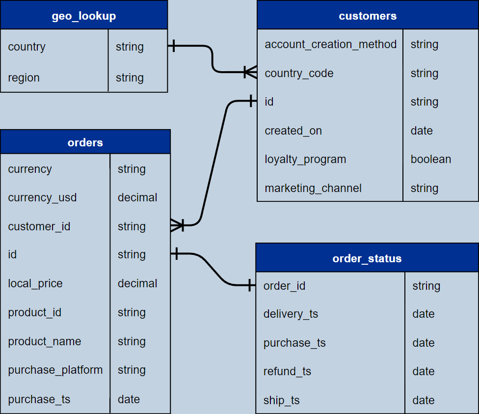
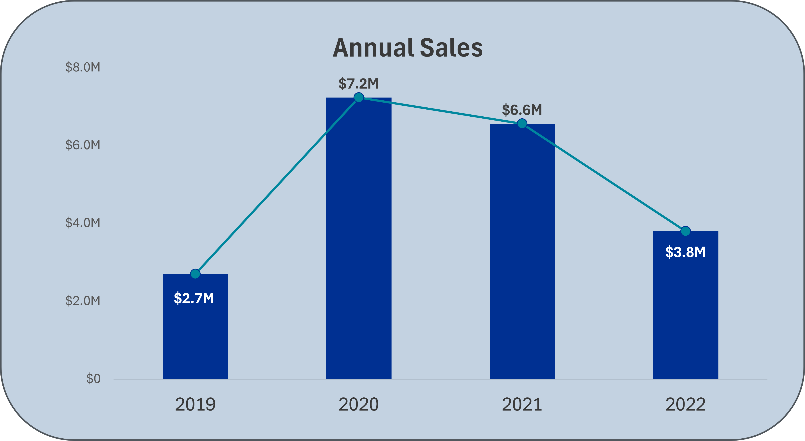
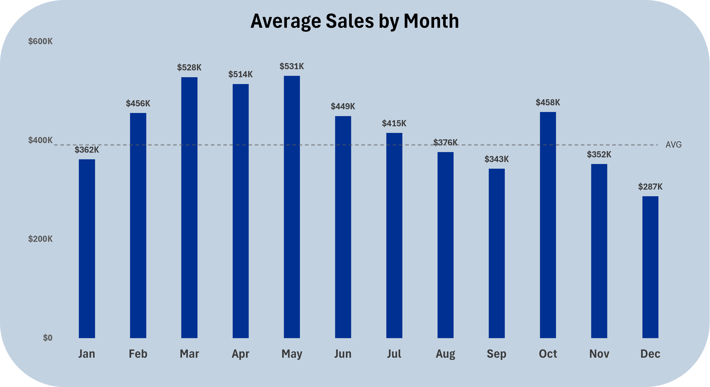
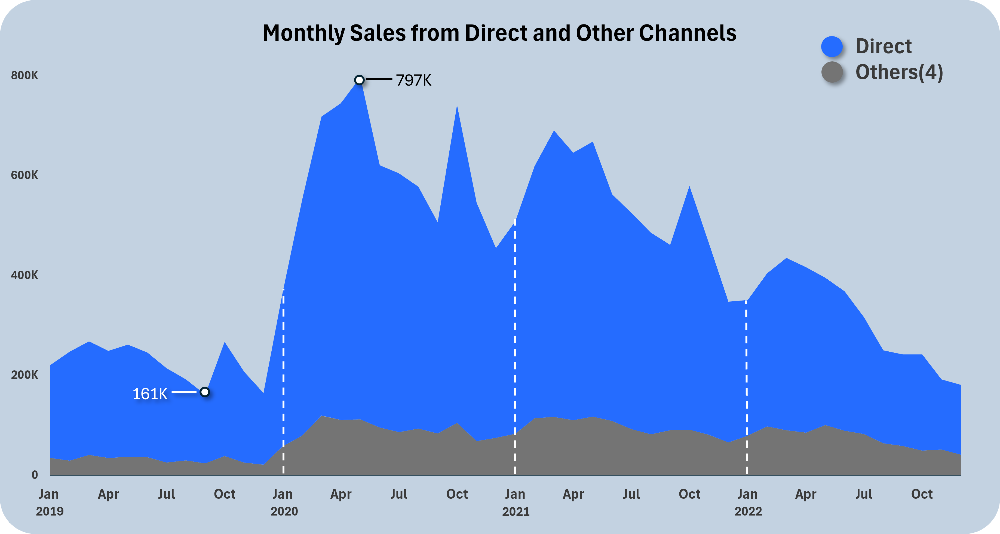
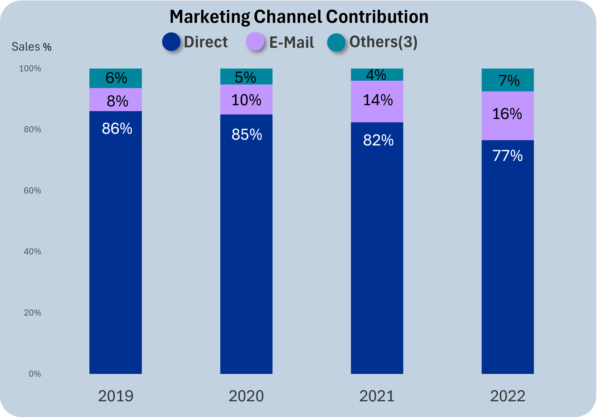
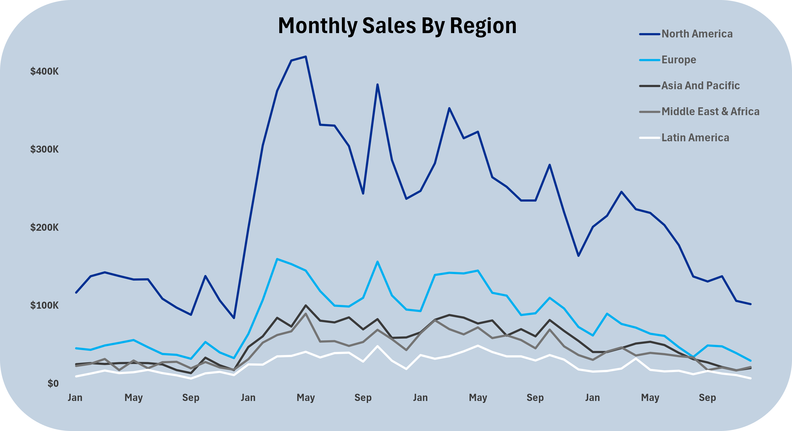
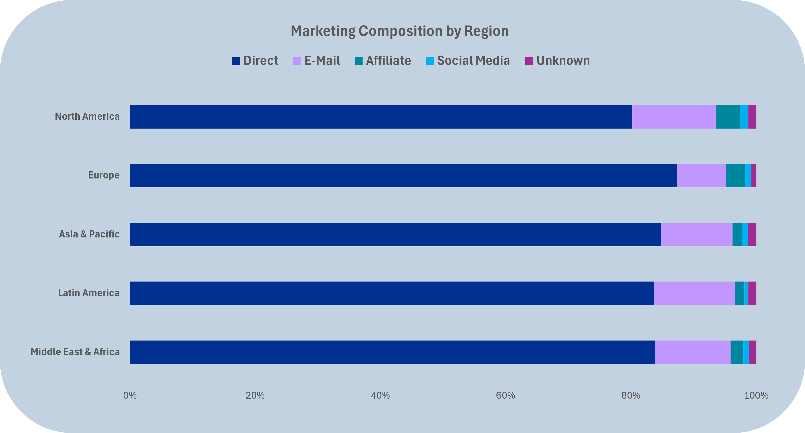
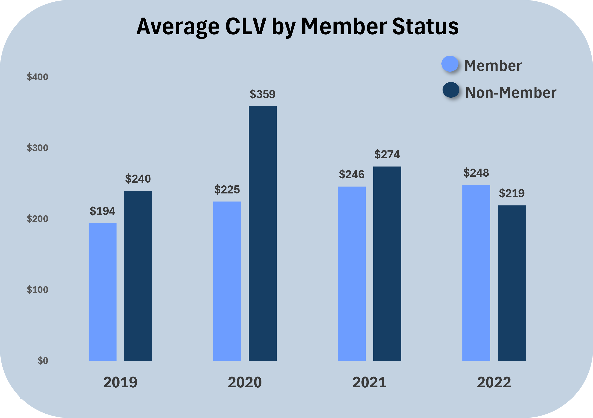
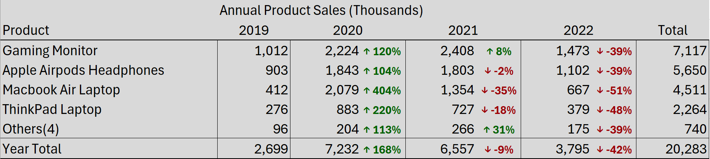

# TRENLINE (E-Commerce) Marketing and Sales Analysis  

Bookmarks:  
- [Background](#background-and-overview)
- [Executive Summary](#Executive-Summary)
- [Analysis Deep Dive](#Marketing-Analysis-Deep-Dive)  
- [Recommendations](#Recommendations)

## Defined Terms  

- **LMP (Loyalty Member Program):** Trenline's free Membership program, prompting users to create a member account.
- **YOY (Year-Over-Year):** The percentage or absolute change in a metric compared to the same period in the previous year.  
- **CLV (Customer Lifetime Value):** The estimated total revenue a customer will generate throughout their relationship with a business.  
- **ROAS (Return on Advertising Spend):** A ratio measuring revenue earned for every dollar spent on advertising.
- **Direct Marketing:** Promotional efforts targeting consumers through digital advertisemets via internet browsing services 
- **Email Marketing:** Promotional messages sent via email to past customers or loyalty members.  
- **Affiliate Marketing:** A performance-based marketing model where third parties earn commissions for driving sales.  
- **Social Media Marketing:** Using organic content to promote products on social platforms without paid advertising.  

## Background and Overview  

Trenline is a global online retailer specializing in consumer electronics. Since commencing operations in 2019, the company has averaged over $5 million in annual net sales, partisipating in the \$650 billion E-commerce market.  

Trenline’s primary marketing strategy involves **Direct Marketing**, promoting one of its eight consumer products. Additionally, the company offers a loyalty program aimed at fostering customer retention.  

This report aims to:  
- Support the Marketing Team with insights and recommendations to increase sales  
- Uncover key drivers in sales channels
- Identify emerging sales trends from 2019 to 2022 
- Provide data-supported changes to the Member Loyalty Program
---
## Data Structure Summary  

Four tables (visualized above) were provided for this analysis:  

- **orders:** Contains unique order identifiers (**id**, primary key) and purchase details, including the customer identifier (**customer_id**), product purchased (**product_name**), purchase date (**purchase_ts**), and purchase value in USD (**currency_usd**).  

- **customers:** Stores customer-related data linked to orders (**id**, foreign key for orders). It includes the marketing channel that drove the initial sale (**marketing_channel**), the customer's membership status (**loyalty_program**), and their country (**country_code**).  

- **order_status:** Tracks order returns, with **order_id** as the foreign key for orders. This table records key dates such as purchase (**purchase_ts**), shipping (**ship_ts**), delivery (**delivery_ts**), and refund (**refund_ts**). ***Note**: Only returned orders are included in this table.*  

- **geo_lookup:** Categorizes countries (**country**, primary key) into regions: Asia-Pacific (**APAC**), Europe (**EURO**), Latin America (**LATAM**), the Middle East & Africa (**MEA**), and North America (**NA**).  

---
## Executive Summary  

Sales have been declining since peaking in 2020 with Sales of \$7.2M, with 2021 YOY Sales dropping 9% (\$6.5M) and YOY decreasing a further 42% (\$3.8M) in 2022. The drops in sales are driven mainly by fewer sales through the Direct Marketing Channel, which has accounted for 83% of revenue historically. Seasonal sales trends suggest sales performance decreases during months of high consumer demand. Sales in November and December were 28% lower compared to the rest of the year. Decreasing YOY sales could indicate increased competition in the market, and cause worse Direct Marketing performance. Product offerings have been very static during the 4 years of opperation with 8 product types offered. 96% of sales are generated by 4 of these categories which include Macbooks, ThinkPads, Apple Headphones, and Gaming Monitors. Sales from the Member Loyalty Program are having little impact on CLV, with less than 1% of Loyalty customers making repeted purchases.

---

## Marketing Analysis Deep Dive

### Revenue Trends  
Revenue peaked in 2020 at $7.2M, a YOY increase of 167% after the first year of operations in 2019 The following years expierienced YOY decreases of 9% in 2021 (\$6.5M) and 42% in 2022 (\$3.8M). Electronics sales perfrom best consistantly Febuary through May and including October while underperforming in September, November, and December. The lack of sales at the end of the year is concernign considering the last 2 months of the year being high retail-demand months during Holidays.

### Sales Channels

The Direct Marketing channel remains the primary driver of sales, accounting for 77% of total sales in 2022. However, its share has been steadily declining both in absolute and relative terms compared to other channels. In 2020, Direct Marketing contributed 85% of total sales, but this figure has gradually decreased over time. The reason for this decline is unclear, though seasonal trends indicate weaker performance during high-demand months, particularly November and December. Sales in these months are even lower than in January, traditionally a low-demand period. This seasonal weakness may be contributing to a declining return on ad spend (ROAS), likely due to increased competition for advertising space

The next-best performing marketing channel is E-Mail, which grew from 10% of total sales in 2020 to 15% in 2022. However, despite its increasing share, sales from this channel are still declining in absolute terms. While a growing customer base should, in theory, enhance the impact of E-Mail marketing, the overall drop in orders from this channel raises concerns about its effectiveness.

Sales from Affiliates and Social Media remain minimal, contributing only 5% of total sales in 2022. While these channels do not directly drive substantial revenue, they serve as valuable tools for brand exposure and promotional opportunities. Social Media could be leveraged to highlight Loyalty Membership Program (LMP) offers, encouraging sign-ups that would, in turn, support E-Mail marketing campaigns. Additionally, Affiliates could be incentivized with direct bonuses for LMP sign-ups, helping expand reach and engagement.

### Geography Analysis 
Sales have been evenly distributed across regions, with North America (NA) being the largest market, accounting for over 50% of total sales. Europe follows with 20%, while Asia and the Pacific (APAC) contribute 12%, the Middle East and Africa (MEA) 10%, and Latin America (LATAM) 6%. Product sales have remained relatively consistent across regions, with minimal variation, except for ThinkPad and MacBook laptops, which sell slightly less in MEA compared to other products. More market data is required to assess product demand variations across regions.

Marketing channel performance also shows little variation across regions, with one notable exception—Europe relies more heavily on the Direct Marketing channel compared to E-Mail marketing relative to other regions.

### Customer Memberships  
The LMP has not demonstrated a significant impact on CLV. LMP customers CLV is 24% lower than non-members. Less than 1% of LMP customers make repeat purchases compared to 9% of non-members. This demonstrates a lack of insentive from the LMP to give valueable offers to customers. While average CLV is trending upwards YOY, the lack of repeat purchases is very small even when comparing to non-members. Less than 50 members made repeat purchases in over four years compared to over a thousand non-members. The missing repeated purchases of members indicate a marketing issue. The value generated by the membership program should be directed at presenting specialized offers to members which increase repeated purchases, and increase CLV. 

### Product Performance 

Six products were initially launched in 2019: Gaming Monitors, Apple AirPods, ThinkPad and MacBook laptops, iPhones, and Samsung Charging Cables. Bose Headphones and Samsung Webcams were added in 2020.

Four products account for over 96% of total revenue. The top sales drivers are Gaming Monitors and Apple AirPods, contributing 63% of revenue. MacBook and ThinkPad laptops follow, generating 33% of revenue despite comprising only 7% of total order volume. The Samsung Charging Cable, while performing well in order count at 21%, contributes just 2% of total revenue.

Given the varying order values of these products, marketing strategies should be adapted accordingly. If the relative cost of Direct Marketing increases, ad placements should prioritize higher-value products with proven conversion success, such as laptops and monitors. Lower-value products could be positioned as promotional deals within the LMP to enhance customer retention and cross-selling opportunities.

---  
## Recommendations  

1. **Optimize Direct Marketing for High-Value Products**

   - Mitigate the impact of declining Direct Marketing performance by focusing efforts on the top four high-order-value products: Gaming Monitors, Apple Headphones, MacBooks, and ThinkPad laptops.

2. **Enhance the Loyalty Memberhsip Program (LMP)**  
   - Increase CLV by restructuring LMP to incentivize repeat purchases and customer engagement:   
     - Implement tiered rewards to encourage higher spending and repeat purchases  
     - Personalize offers based on purchase history to improve engagement and retention
     - Introduce referral incentives, such as coupon discounts, to encourage existing customers to refer new LMP sign-ups

3. **Leverage Membership for E-Mail Marketing**  
   - Increase CLV by Utilizing LMP to target members with personalized email campaigns focusing on:  
     - Similar products to previous purchases
     - Complementary products(ie Apple headphones for previous iPhone customers)
     - Exclusive discounts or product bundles to drive additional purchases and increase retention
     - New product launches to gather feedback on potential future offerings
   - Strengthen engagement by incorporating dynamic content, such as limited-time offers and interactive promotions, to boost conversion rates.

4. **Address Seasonal Sales Weakness**
   - Counteract sales declines in November and December by launching targeted holiday promotions focused on high-performing products.

   - Implement strategic discounting and bundling for seasonal campaigns to drive conversions during high-demand periods.

5. **Expand Product Offerings**  
   - Reduce potentialnegative impact from static offerings by researching mid-to-high priced, high-demand electronics products that may perform well such as TVs, Android smartphones, and Apple Watches.
   - Enhance LMP value by providing members with exclusive early access to new product launches and limited-edition items.

6. **Diversify and Strengthen Low-Performing Marketing Channels**

   - Expand Social Media and Affiliate engagement strategies to increase brand visibility and improve conversions:

      - Launch targeted ad campaigns showcasing best-selling products and LMP benefits
      - Offer exclusive social media promotions to incentivize purchases and increase engagement
      - Provide affiliates with additional incentives for driving LMP sign-ups alongside product sales.

## Data Caveats & Limitations

1. **Marketing Budget Data is Not Available**

   - The dataset does not include marketing spend across channels (Direct, Email, Affiliate, and Social Media Marketing).

   - As a result, ROAS (Return on Ad Spend) and cost efficiency by channel cannot be directly calculated. Instead, marketing effectiveness was evaluated using sales contribution and revenue trends.

2. **Customer Engagement Data is Limited**

   - The analysis focuses on purchase data but does not include site visits, ad impressions, or email engagement metrics, which could provide deeper insights into marketing performance.

3. **Competitive & Market-Wide Factors Not Considered** 

   - External influences such as competitor pricing, industry trends, and macroeconomic conditions (Corona Virus) are not included or considered in this dataset.

   - This means that while declining sales and seasonal trends are observed, their underlying causes may extend beyond Trenline’s internal strategies.